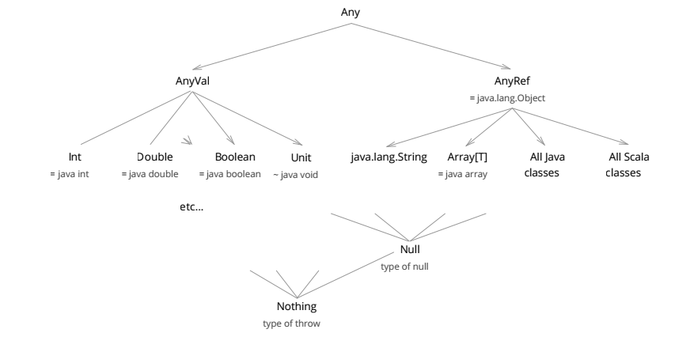

# Scala Journey

### Best sources
* [Essential Scala](http://underscore.io/training/courses/essential-scala/)
* [StackOverflow Scala wiki](https://stackoverflow.com/tags/scala/info)
* When in doubt, check the [Scala official API](http://www.scala-lang.org/api/2.12.2/)

### Notes
Scala changes very quickly.

* 2.12.0 released 03-Nov-2016
* 2.11.0 released 21-Apr-2014
* 2.10.0 released 04-Jan-2013
* Any older is too different. eg. dramatic changes in Array representation in Scala 2.8:
[Scala Docs - Arrays](http://docs.scala-lang.org/overviews/collections/arrays.html)

Type hierarchy:

### Specific
* Although types optional, it's a good idea to define it to check errors at compile time.
* Difference between 'val' and 'var': val is "final", var is not.
* Default type for an ambiguous "var" is "Any", which is the grand supertype of all Scala types.
If type ambiguous, Scala chooses their closest common ancestor.
* Why no "i++" in Scala - https://stackoverflow.com/questions/4520463/why-no-i-in-scala
* Scala’s == operator is smart - it delegates to equals rather than comparing values on reference identity
